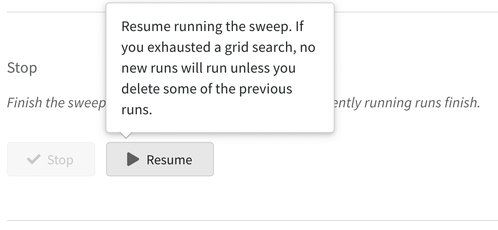

# Demo of using W&B to assist in machine learning research

# Quick overview

Weights & Biases (W&B) is the machine learning platform for developers to build better models faster. Weights & Biases can:

- Store hyper-parameters used in a training run
- Search, compare, and visualize training runs
- Run parameter sweeps
- ...

Please see the official [Documentation](https://docs.wandb.ai/) of for details.

The codes in this repository implement the experiments about training and testing the classification model (using the [MNIST](http://yann.lecun.com/exdb/mnist/) dataset). More important, these codes incorporate W&B API to manage the experiments and record data. This repository can serve as a reference to use W&B.

# Requirements

- pytorch
- tqdm
- wandb

# Set up wandb

[Sign up and Login wandb account](https://docs.wandb.ai/quickstart#1.-set-up-wandb).

Avoid uploading model weights (saved in wandb local directory) to wandb cloud:

https://github.com/geyao1995/wandb_demo/blob/23b6672582c6ae74920d5f7cbbdf7678bb515fd6/help_funcs_wandb.py#L11

# W&B helps following tasks

## record hyper-parameters

Pass config dictionary when initialize W&B: 

https://github.com/geyao1995/wandb_demo/blob/331385c5d3f463c6ed8e45f52982bdcbd3592f6c/train_mnist.py#L26-L29

Reference: [Configure Experiments with `wandb.config`](https://docs.wandb.ai/guides/track/config)

## log metric

Log accuracy (x-axis) according to epoch (y-axis):

https://github.com/geyao1995/wandb_demo/blob/331385c5d3f463c6ed8e45f52982bdcbd3592f6c/train_mnist.py#L65

Log learning rate per batch:

https://github.com/geyao1995/wandb_demo/blob/331385c5d3f463c6ed8e45f52982bdcbd3592f6c/trainer.py#L63-L64

Reference: [Log Data with `wandb.log`](https://docs.wandb.ai/guides/track/log)

## sweep parameters

Load different parameter configs from wandb:

https://github.com/geyao1995/wandb_demo/blob/331385c5d3f463c6ed8e45f52982bdcbd3592f6c/train_mnist.py#L31

Rerun specific parameter config: 

Delete that run and rerun the sweep, the completed run will be skipped. A [bug](https://github.com/wandb/wandb/issues/3344) may cause this fails and the fix is click resume button in sweep control page of UI:

Reference:

- [Sweep Configuration](https://docs.wandb.ai/guides/sweeps/configuration)
- [wandb.sweep](https://docs.wandb.ai/ref/python/sweep)
- [Introduction to Hyperparameter Sweeps using W&B](https://colab.research.google.com/github/wandb/examples/blob/master/colabs/pytorch/Organizing_Hyperparameter_Sweeps_in_PyTorch_with_W%26B.ipynb#scrollTo=Sf1VvnIyrIp3)

# How to check the logged data?

## From cloud

### Visualize UI

Check from [wandb](https://wandb.ai/) website.

### Get data

https://github.com/geyao1995/wandb_demo/blob/23b6672582c6ae74920d5f7cbbdf7678bb515fd6/help_funcs_wandb.py#L65

Reference: [Export Run Data](https://docs.wandb.ai/guides/track/public-api-guide#export-run-data)

## From local

[wandb使用教程(四)：wandb本地部署](https://zhuanlan.zhihu.com/p/521663928)

TODO

